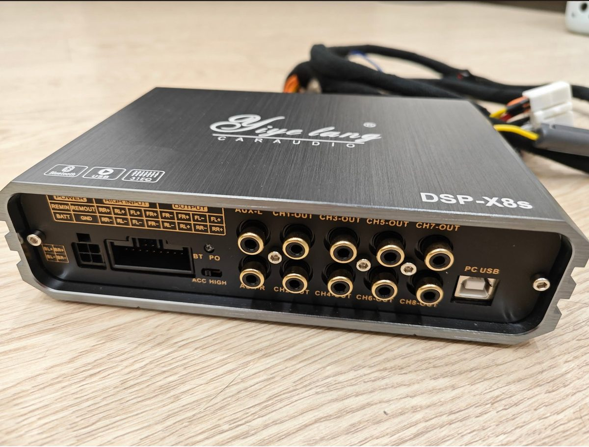

# DSP-X8s 網頁調音器

**直接使用：<https://cheng-hsiang.github.io/dspx8/>**



<sub>照片：Corolla Cross Club 官方社團 Deema Lee 拍攝，拍得很好，借來示意。如果造成困擾，請通知我，我會拿掉。</sub>

適用機型：Yiye lang DSP-X8s（機身印有 DSP-X8s，原廠微信小程序是 ONE-APP）。

- iPhone 請用 [Bluefy](https://apps.apple.com/app/bluefy-web-ble-browser/id1492822055) 開啟，Android 用 Chrome。打開後第一個分頁就是使用說明。
- 沒有機器也想先看看：<https://cheng-hsiang.github.io/dspx8/?sim=1>（模擬模式，不會連到真的機器）。

Yiye lang DSP-X8s 車用 DSP 的 Web Bluetooth 調音網頁。沒有離線快取，也沒有 Service Worker。規格：`docs/superpowers/specs/2026-09-29-dsp-x8s-web-tuner-design.md`，第一階段計畫：`docs/superpowers/plans/2026-09-30-dsp-x8s-phase1-implementation.md`。

## 需求

- Android：Chrome 或 Edge。iPhone：安裝 Bluefy 瀏覽器後用它開啟網址。
- 網址必須是 HTTPS（GitHub Pages、Netlify 皆可）。開發時 `http://localhost:8080` 可用。

## 開發

- `npm test`：Node 22 單元測試（協定、佇列、裝置流程全部用模擬機器測）。
- `npm run smoke`：用無頭 Chrome 開啟模擬機器版本，自動連線、整機讀取、寫入測試、聲音頁（主音量、靜音、相位、各聲道音量、延時、輸入源）、EQ 預設與拖曳、另一層疊加提示、模式切換與儲存、自動調音（RTA 的計權、倍頻、峰值保持與校正，Q 驗證、量測、套用、再量、後聲道音量平衡、還原、複製貼上），並用 Chrome 的假麥克風跑一次真的麥克風路徑，檢查報告摘要與 console 錯誤。
- `npm run serve`：啟動本機伺服器。`http://localhost:8080/?sim=1` 用模擬機器，不需藍牙。
- `npm run tables`：從反編譯結果（`../src/data/utils/TabMainUtil.js`）重新產生 `js/protocol/tables.js`。
- `npm run icons`：重新產生 PWA 圖示。
- 改版時改 `index.html` 的 `data-version`。沒有離線快取，每次開啟都從網站載入最新版。
- 日誌裡的 Q 值一律以原廠換算顯示（原始值 × 3.17 ÷ 100），例如 `Q=240 (Q 7.6)`。

## 部署

GitHub Pages：repo 是 `https://github.com/cheng-hsiang/dspx8`，Pages 從 `main` 分支根目錄發布，網址 `https://cheng-hsiang.github.io/dspx8/`。根目錄本身就是完整網頁，所有路徑都是相對的。更新流程：`npm run pack`、commit、push，一兩分鐘後生效。`dist` 也一起版控，給 Netlify 用。

Netlify：先 `npm run pack`，到 app.netlify.com 的 Drop 頁把 `dist` 資料夾拖進去，取得 `https://<名稱>.netlify.app`。更新時到該網站的 Deploys 頁再拖一次。

## 真機測試（2026-09-30 已完成兩輪：連線、整機讀取、10 段層與 31 段層寫入皆正常）

1. 開網址（Android 用 Chrome，iPhone 用 Bluefy）。藍牙分頁頂端會顯示版本號。
2. 車上音量調低。按「連線」，在清單裡選「Mango3.0」，等整機讀取 21 / 21。原廠 App 連著時要先關掉。
3. 寫入測試：CH1、頻段 3、+6 dB，按「執行寫入測試」，聽是否有變化，然後按「還原為 0 dB」。
4. 切到「日誌」分頁，按「複製報告摘要」，貼給開發者。複製失敗改用「分享」或「匯出 .txt」。
5. 「聲音」分頁可逐一靜音 CH1 到 CH8，找出每個 CH 實際接到哪顆喇叭。

## 真機行為（由日誌推得）

- **機器有重開過。** 第三輪日誌最後是機器那端斷線（GATT 斷線事件），距離最後一次操作約 25 分鐘，符合熄火。之後 8 個聲道的音量在沒有任何 App 寫入的情況下變了（見下一點），只有機器重新啟動會這樣。原廠 App 也沒動過：10 段層的頻率還是網頁寫的 50 Hz，原廠一連線就會改回 60 Hz。
- **沒儲存的設定會留住。** 重開後連線，31 段層是上一次最後載入、沒按儲存的曲線（華語抒情），不是模式 1 存的 K-pop。下一次隔 53 分鐘再連，也是上一次沒儲存的 K-pop。機器會記住最後的工作狀態；「儲存到模式」是另存一份可以叫回來的備份。
- **各聲道音量差距不會保留。** 第三輪結束時 CH1 到 CH3 是 89、其他是 100，重開後 8 個聲道全是 89：開機時機器把 CH1 的音量套到所有聲道。因此前後平衡交給自動調音，用 EQ 做。

## 說明頁（0.5.0）

給第一次使用的人看的說明書，也是第一次開啟網頁時的預設分頁（之後會記住上次停留的分頁）。

- 最上面依對方的瀏覽器直接說能不能用：iPhone 的 Safari／Chrome 會被引導去裝 Bluefy，從 LINE、Facebook、微信裡開的會被提醒改用正確的瀏覽器，Android 其他瀏覽器會被引導到 Chrome（`js/help/advice.js`）。
- 「三步開始」與「不會調？照這樣做」常駐顯示；iPhone 限制、Android 用法、各分頁用途、設定會不會不見、喇叭接法不同、常見問題都收在可展開的段落，符合對方平台的那一段預設展開。
- 「分享給車友」按鈕送出不含參數的乾淨網址。
- 「遇到問題怎麼辦」：一鍵複製問題回報（版本、瀏覽器、機器名稱、一行讓使用者填的問題描述，加上日誌），貼給開發者或開 GitHub Issue。聯絡方式集中在 `js/help/issue-report.js` 的 `CONTACT`。日誌頁最上面也有同樣的提示。

## 版面

分頁共七個：說明、藍牙、聲音、EQ、自動調音、模式、日誌。分頁列在最上方（狀態列下面），因為 Netlify 免費方案會在右下角放「Powered by」徽章，會擋住底部的按鈕。

## 聲音頁（0.3.0）

- 輸入源四選一（藍牙、高電平、AUX、USB），寫 M0_8，高亮以機器回報的 M0_22 為準。
- 主音量寫 MIX11_1..8，移動時各聲道之間的差距保持不變：以開始拖曳那一刻的各聲道音量為基準，全部一起移動（0.3.1 修正：之前每一步都從尚未回應完的快取重算，真機上曾讓 CH1 到 CH3 落後 11 格）。「各聲道對齊」把所有聲道拉到最大聲那一個。各聲道音量各自寫 MIX11_k，0 到 100。
- 每個聲道一列：名稱（本地）、靜音（MUTE）、相位 0°/180°（切 MIX41 輸入 1 的 flag，flag 有 = 0°，與原廠程式一致）、音量、延時。
- 延時可直接輸入公分（程式換算成微秒寫入 DELAY_k），或用 − / + 以 1 個 48 kHz 取樣點（20.8 µs，0.72 cm）微調，範圍 0 到 20 ms。± 以最後送出的值為基準，輸入公分後立刻按 ± 不會被舊值蓋掉。預設只顯示 CH1 到 CH4，勾選可顯示 CH5 到 CH8。

## 模式頁（0.3.0）

- 8 個槽都是使用者預設槽。點其他模式送呼叫指令，鎖定寫入並暫停心跳，1.2 秒後整機重讀（狀態列顯示「切換模式中」）。
- 「儲存到模式 N」只寫進目前模式（與原廠 App 相同），需確認。頁面會顯示自上次讀取或儲存以來有多少筆模式區設定尚未儲存；切換模式時若有未儲存變更會先警告。
- 模式名稱只存在此瀏覽器。建議模式 1 保持原廠平直，調好的音色存到 2 到 5。

## 自動調音頁（0.4.0）

**尚未在真車上測試。** 目前只在模擬車廂與 Chrome 的假麥克風上驗證過，頁面最上方、說明頁與套用確認框都標示「未測試」。真機驗證後再拿掉。

- 用手機麥克風收粉紅噪音，經 IEC 61260-1 的 31 段 1/3 倍頻濾波器分析（見下一節），算出 31 段 EQ 的增益。機器的 31 個中心頻率各自落在同一序號的 IEC 頻段內，所以量到的頻段和 EQ 頻段一對一。
- 流程：開啟麥克風 → 驗證 Q 值（第一次）→ 選前或後 → 開始量測（程式自動把另一組靜音，量完恢復）→ 看建議 → 套用 → 再量一次確認 → 到模式頁儲存。
- 計算方式：量到的聲音已經包含目前的 EQ（兩層都算），先扣掉得到車子本身的響應，再算出新的 31 段增益，讓結果接近目標曲線（低頻加強、高頻微降，可選）。只修形狀不改整體音量；後聲道若比前聲道大聲，會整體降到前聲道 −3 dB。
- 保護：40 Hz 以下與 20 kHz 不修正；麥克風收不到的高頻段不修正；70 Hz 以下只衰減；後門 5 kHz 以上只衰減（沒有高音）；比兩旁低 6 dB 以上的窄凹陷不補；提升上限低頻 +6、中頻 +4、10 kHz 以上 +3 dB；有量背景噪音時，訊號比背景高不到 10 dB 的頻段不修正。
- Q 驗證：前聲道 1 kHz 暫時 +9 dB，比較旁邊頻段的變化和兩種 Q 換算的預測，判定機器的 Q 是「原始值 ×3.17 ÷100」還是「原始值 ÷100」。沒驗證前只套用一半的修正。
- 套用會把該組 31 段的頻率回到出廠位置、Q 統一 4.3，並把 10 段層歸零；「還原上次套用」可以回復。EQ 改過之後，之前的量測自動作廢。
- 日誌會記下每次量測的 31 個頻段數值、Q 驗證結果與套用內容。開機時也會記錄這個瀏覽器能不能用麥克風。
- 麥克風不能用時（Bluefy 可能如此）：在 Safari 開同網址量測，按「複製量測結果」，回 Bluefy 貼上。
- 量測時手機不能連車上藍牙音樂（iPhone 會切成通話模式、改用車機麥克風）。粉紅噪音用另一台裝置或隨身碟播放；頁面可下載 60 秒 WAV。
- `?sim=1` 有一台模擬車廂，聲音依模擬機器目前的 EQ 與靜音計算，可以在家試整個流程；`?simQ=1` 模擬 Q 是 ÷100 的情況，`?tuneSec=1` 把量測縮短成 1 秒（測試用）。

## 即時頻譜分析（RTA，0.7.0）

自動調音頁第一張卡片就是 RTA，自動調音的量測也用同一套分析。原本用瀏覽器內建的 FFT 估算，0.7.0 起改成照量測儀器的標準做。

| 項目 | 依據 | 做法 |
|---|---|---|
| 頻段 | IEC 61260-1:2014（同 ANSI/ASA S1.11-2014）、ISO 266 | 1/3 倍頻 31 段，中心頻率用標準的精確值 1000·10^(n/10) Hz（19.95 Hz 到 19.95 kHz），畫面標示用名目值（20、25、31.5 … 20k）。 |
| 濾波器 | IEC 61260-1:2014 class 1 | 每段是 6 階 Butterworth 帶通（6 個二階節），在時域逐個取樣點運算，跑在 AudioWorklet 裡。不支援 AudioWorklet 的瀏覽器退回 ScriptProcessor，算法相同。 |
| 時間計權 | IEC 61672-1:2013 | F（125 ms）、S（1 s）指數平均，以及等效位準 Leq（線性平均）。 |
| 頻率計權 | IEC 61672-1:2013 | A、C、Z，依各頻段的精確中心頻率套用；總位準由各頻段相加。 |
| 位準 | AES17 | dBFS，滿刻度正弦波 = 0 dBFS。校正後顯示 dB（音壓）。 |
| 平均時間 | Bendat & Piersol | 隨機噪音的頻段位準標準差 ≈ 4.34/√(B·T) dB。Leq 模式會顯示目前的統計誤差。 |

其他功能：1/1 倍頻（由三個 1/3 倍頻相加）、峰值保持、暫停、背景噪音虛線、過載與太小聲提示、把目前頻譜寫入日誌、音量校正（輸入音壓計讀數）、載入量測麥克風的校正檔（REW、miniDSP UMIK、Dayton iMM-6 的文字格式）。

**怎麼驗證的。** `test/tune-iec.test.js` 和 `test/tune-rta-bank.test.js`：

- 濾波器係數算出的頻率響應和 `scipy.signal.butter(6, …, 'bandpass')` 相差小於 1e-6 dB。
- 48 kHz 下 31 段、44.1 kHz 下前 30 段，在 IEC 61260-2 的測試頻率格點上（每個頻寬 24 點），相對衰減全部落在 class 1 的容差內。2014 版與較嚴格的 1995 版（同 ANSI S1.11-2004）都檢查。
- 有效頻寬偏差小於 0.1 dB（class 1 允許 ±0.4 dB）；相鄰頻段相加的平坦度在 +0.8 / −1.8 dB 內。
- 時域：頻段中心的正弦波讀數誤差小於 0.1 dB；粉紅噪音各段平坦；白噪音每段上升 1 dB。
- F、S 計權對 4 kHz 猝發音的響應符合 IEC 61672-1 的參考值（F 200 ms −1.0 dB、F 50 ms −4.8 dB、S 500 ms −4.1 dB、S 200 ms −7.4 dB），衰減率 34.7 與 4.34 dB/s。
- A、C 計權在各中心頻率的值與 IEC 61672-1 的表列值相差不到 0.05 dB。

**不能宣稱的部分。**

- 這是「濾波器與計權的數學規格符合標準並經測試」，不是檢定過的儀器。儀器的 class 1 還包含麥克風、線性範圍、溫度等項目，要由實驗室依 IEC 61260-2、IEC 61672-2 檢驗。
- IEC 61260-1:2014 的容差表取自開源程式庫 phonometry（MIT 授權，註明抄錄自 BS EN 61260-1:2014 表 1），沒有直接對照標準原文；1995 版的數值與 ANSI S1.11-2004 一致。
- 44.1 kHz 取樣時 20 kHz 段的上緣超過 Nyquist 頻率，做不成標準濾波器，畫面以灰色表示。iPhone 是 48 kHz，不受影響。
- 手機內建麥克風沒有個別校正。文獻的結論是：Kardous 與 Shaw（2014）測試 iPhone 上的音壓計 App，只有少數幾個在 65–95 dB 的粉紅噪音下與 type 1 音壓計的平均差在 ±2 dB(A) 內；Celestina 等（2018）發現要外接校正過的麥克風，App 才達得到 IEC 61672 class 2。所以看頻譜形狀、比較調整前後可靠，絕對音壓要外接量測麥克風並校正。

**iPhone 瀏覽器的已知限制**（程式會自動偵測並寫進日誌）：

- Bluefy 這類以 WKWebView 做的瀏覽器，麥克風進 Web Audio 可能全是靜音（WebKit bug 196293）。開麥克風 2.5 秒後若取樣全為 0，頁面會提示改用 Safari 量、再貼回 Bluefy。
- iOS 的瀏覽器可能把高頻濾掉（WebKit bug 179411 的回報是 9–12 kHz 以上）。量測時最高的幾段若比中頻低 40 dB 以上，視為麥克風收不到，自動調音不修正那些頻段。
- 每次開麥克風，日誌都會記下取樣率、擷取方式、瀏覽器實際套用的語音處理設定，以及前 2.5 秒的 31 段頻譜。

**參考文獻**

- IEC 61260-1:2014, *Electroacoustics – Octave-band and fractional-octave-band filters – Part 1: Specifications*.
- IEC 61672-1:2013, *Electroacoustics – Sound level meters – Part 1: Specifications*.
- ISO 266:1997, *Acoustics – Preferred frequencies*.
- AES17-2020, *AES standard method for digital audio engineering – Measurement of digital audio equipment*.
- J. S. Bendat, A. G. Piersol, *Random Data: Analysis and Measurement Procedures*, Wiley.
- C. A. Kardous, P. B. Shaw, "Evaluation of smartphone sound measurement applications," *J. Acoust. Soc. Am.* 135(4), EL186–EL192, 2014.
- C. A. Kardous, P. B. Shaw, "Evaluation of smartphone sound measurement applications (apps) using external microphones – A follow-up study," *J. Acoust. Soc. Am.* 140(4), EL327, 2016.
- M. Celestina, J. Hrovat, C. A. Kardous, "Smartphone-based sound level measurement apps: Evaluation of compliance with international sound level meter standards," *Applied Acoustics* 139, 119–128, 2018.
- phonometry（<https://github.com/jmrplens/phonometry>）：容差表與設計方法的對照來源。

## EQ 頁（0.2.x 起）

- 預設依車主配置分「前 CH1+CH2」「後 CH3+CH4」兩組連動；「進階」可切到單一聲道或全部 8 聲道。
- 兩層可選：「31 段（模式區）」是完整參數 EQ，隨模式儲存與呼叫；「10 段（原廠層）」是原廠 App 用的那層，不在模式區。兩層真機都已確認可寫，而且同時作用：當另一層有不是 0 dB 的頻段時，頁面會提示並提供「歸零另一層增益」。
- Q 換算：機器的 Q 原始值乘 3.17 才是一般定義的 Q（原廠程式常數 7.6/2.4；真機 31 段層出廠 Q 原始值 240 = Q 7.6）。兩層預設都用這個換算，可手動改成 1。
- 曲線上的點可拖曳（上下改增益、左右改頻率）；下方可精確選頻率、Q、增益。每次變更 50 ms 內合併送出，停 300 ms 後讀回比對，不符標紅。
- 內建 14 組預設在 `presets/`（清單與新增規則見 `presets/README.md`），載入會覆寫前後兩組全部增益，並把另一層不是 0 dB 的頻段一起歸零（先確認）。可存本地預設、匯出、匯入 JSON。
- 頻段顯示「未啟用」代表機器上該段 TYPE 或頻率為 0，程式不會寫它。

## 安全

- 客戶代碼不是 4006 時自動唯讀。
- 只寫 F、G、Q 與規格列出的聲音暫存器，程式層拒絕寫入任何濾波器 TYPE 欄位。
- 連線即自動快照，可在藍牙分頁匯出。儲存到模式需經確認，只寫進目前模式；切換模式前會提示未儲存的變更。

## 目錄

```
js/protocol/   CRC、封包、編碼、位址表、指令（純函式，無瀏覽器相依）
js/transport/  Transport 介面、Web Bluetooth 實作、模擬機器
js/core/       佇列、暫存器快取、裝置流程、日誌、報告、本地保存
js/tune/       自動調音與 RTA：IEC 濾波器設計、AudioWorklet 濾波器組、麥克風檢查與校正、擬合與修正規則
js/ui/         七個分頁與共用元件
tools/         開發伺服器、表格產生器、圖示產生器、無頭冒煙測試
test/          node:test 單元測試
```
